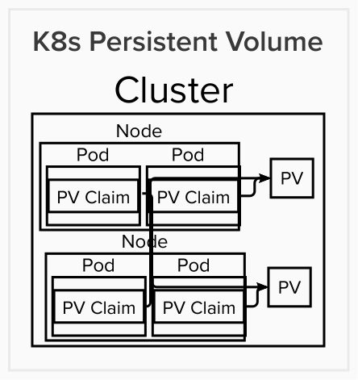

# Volumes & Persistent Volume

Part of the goal of this challenge is to set up a volume to write these files. There are two types of volumes: Volumes and Persistent Volumes both allow the user to persist the data. However, Volumes are Pod and Node dependent. Pratically speaking, this means that volumes are destroyed when a Pod is removed. This makes Volumes not as persistent as desired and hard to administer.

Persistent Volumes are standalone Cluster resources and therefore are Pod and Node independent. The Persistent Volume Claim belongs to the Pods and the Nodes on which the Pods run. This means that when Pods are destroyed, this volume type will persist. There are many types of Persistent Volumes, and one of the most flexible types is called Container Storage Interface (CSI). This persistent volume type facilitates the utilization of any storage solution as long as there is a CSI driver for this solution or one could create a custom driver. The one I am going to focus on for this challenge is the AWS EFS CSI.

# file-writer-deploy.yaml: Services

The name of the Storage Class is efs-sc.

The name of the Persistent Volume is efs-pv. Since EFS is a file system service, the volumeMode is Filesystem. Since EFS is an elastic file system, it does not enforce any file system capacity. However, a storage value was provided of 5Gi since Kubernetes requires it. ReadWriteMany was chosen for the accessMode so that multiple nodes can use that volume. Use the FILE_SYSTEM_ID generated in AWS above for the volumeHandle.

The name of the PersistentVolumeClaim is efs-pvc. ReadWriteMany was chosen for the accessMode so that multiple nodes can use that volume. The storageClassname is efs-sc from the Storage Class service. Since EFS is an elastic file system, it does not enforce any file system capacity. However, a storage value was provided of 5Gi since Kubernetes requires it.

This Persistent Volume was attached to the container via persistentVolumeClaims and volumeMounts in the Deployment Object. Based on the information in the Instructions.md document that the file-writer container writes data files to /var/file-writer, the mountPath assumes that the workdir on the dockerfile is /var and there is a folder names "file-writer" in the working directory in the container.

# Using AWS EKS

Since my assumption is that Rvian is using Cloud Provider versus its own Custom Data Center, there are two options: create and connect the machine and install and configure software manually or an open-source project used to set up Kubernetes clusters easily like kops. The other option is a managed service for kubernetes deployments which defines the cluster architecture, for example AWS Elastic Kubernetes Service. AWS EKS uses standard kubernetes configurations.

## 1. AWS: Steps for creating an Elastic Kubernetes Service

Search for EKS, insert a name for the EKS cluster, create Cluster Service Role via the Identity & Access Management (IAM) Service (choose EKS-Cluster), CloudFormation to create VPC Network. In the User folder, the user will find a .kube folder assuming that the user installed Minikube. My assumption is that the user has already installed the AWS CLI tool. Also, create an AWS access key and download the pem file if the user has not already done so. This pem file contains and AWSAccessKeyID and AWSSecretKey. 

## 2. AWS:Configuring AWS CLI to interact with the User's Managed AWS EKS Cluster

In the terminal, type "aws configure" and type the AWSAccessKeyID, AWSSecretKey, and Default region name into the terminal when prompted to do so. Now the AWS CLI is configured to interact with the user's AWS account from the command line. To activate the kubernetes cluster that was setup previously, type "aws eks --region NAME_REGION_CHOSEN update-kubeconfig --name EKS_CLUSTER_NAME". Now the user can use kubectl commands that will interact with the user's Managed AWS EKS cluster.

## 3. AWS: Adding Worker Nodes

Go to compute section on the user's cluster and "Add a Node Group". Insert name, Node IAM (choose EC2 -> AmazonEKSWorkerNodePolicy, AmazonEKS_CNI_Policy, AmazonEC2ContainerRegistryReadOnly), Node Group compute configuration (use at least t3.small).  

## 4. AWS: Steps for adding AWS EFS as a Persistent Volume

#### 1. From this URL (https://github.com/kubernetes-sigs/aws-efs-csi-driver), copy and paste: kubectl apply -k "github.com/kubernetes-sigs/aws-efs-csi-driver/deploy/kubernetes/overlays/stable/?ref=release-1.3" in the terminal to install the driver in the user's Kubernetes Cluster.

#### 2. Create an elastic file system on the AWS account: choose name, VPC for cluster, security group

#### 3. Copy and paste File System ID (FILE_SYSTEM_ID), e.g. fs-########. 

#### 4. Step for applying updated yaml file: Use "kubectl apply -f=file-writer-deploy-JG" in the terminal.

# Capacity Planning

Utilize a resource that can measure inputs, outputs, and throughput. It should also be able to provide monitoring and alerts. An example of an AWS resource like this is IOPS. It measures how many IO requests can be completed by the storage device in a second. It can assess throughput and find bottlenecks.

A concern with EFS is that hundred of thousands or millions files in the system can cause latency issues. It can take a significant amount of time to delete these small files. One solution would be to create subfolders based on a time stamp.

Steps for calculating data storage capacity requirements:

#### 1. Collect the data

#### 2. Determine the growth rate of the data

#### 3. Consult with stakeholders (IT management)

#### 4. Set realistic data storage goals

# Monitoring Files

Go to Amazon EFS > File system and click the Name of the File System, e.g. eks-efs. Then click the Monitoring and Metered size tabs. Options for monitoring files include (https://docs.aws.amazon.com/efs/latest/ug/monitoring_automated_manual.html):

#### Amazon CloudWatch Alarms

#### Amazon CloudWatch Logs

#### Amazon CloudWatch Events

#### AWS CloudTrail Log Monitoring

# Idealized Architecture

Another type of persistent volume that could be used is the AWS Elastic Block Store (awsElasticBlockStore). However, AWS EBS can only be accessed by a single instance at a time whereas EFS can have hundreds or thousands of instances accessing the file system simultaneously. EFS costs more than EBS ($0.30 per GB for EFS vs. $0.10 per GB for EBS). Thus, the choice depends on the specifics of the use case.

A different approach would be to use an ephemeral volume and connect that to an S3 bucket, e.g. EmptyDir or hostPath. One approach to get the data from the local directory to S3 would be to use S3FS to mount as a volume in the Pod. Rsync could be used in conjunction with S3FS. It would be desirable to avoid duplication on the S3 bucket and delete the local files after copying them to the S3 bucket. The deduplication can be achieved via StorReduce’s deduplication software (https://aws.amazon.com/blogs/apn/cloud-deduplication-on-demand-storreduce-an-apn-technology-partner/).

There was no mention in the Instructions.md of the communications required between the Pods or the Pod and the outside world. Thus, the main object missing from the file-writer-deploy-JG yaml file is the Service object. The Service object is responsible for facilitating communications between Pods and/or the external world. There are three types of Service object types: ClusterIP, NodePort, and LoadBalancer. The choice of the Service object type is dependent on the type of communication desired between the Pods and the Pods and the outside world.

For the ephemeral approach, it would be advisable to utilize IAM role assumption for security purposes. A tool like kube2iam and kiam could be utilized to allow the container to assume a role which would allow the container to access the S3 bucket.