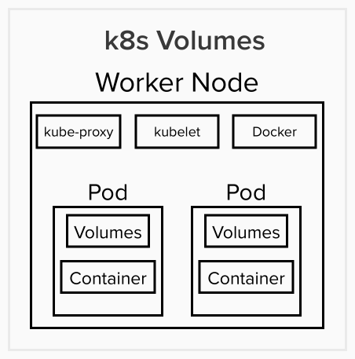

# Volumes & Persistent Volume

Part of the goal of this challenge is to set up a volume to write these files. There are two types of volmumes: Volumes and Persistent Volumes both allow the user to persist the data. However, Volumes are Pod and Node dependent. Pratically speaking, this means that volumes are destroyed when a Pod is removed. This makes Volumes not as persistent as desired and hard to administer.

Persistent Volumes are standalone Cluster resources and therefore are Pod and Node independent. The Peristent Volume Claim belongs to the Pods and the Nodes on which the Pods run. This means that when Pods are destroyed, this volume type will persist. There are many types of Persistent Volumes, and one of the most flexible types is called Container Storage Interface (CSI). This persistent volume type faciliates the utilization of any storage solution as long as there is a CSI driver for this solution or one could create a custom driver. The one I am going to focus on for this challenge is the AWS EFS CSI.

# file-writer-deploy.yaml: Services

The name of the Storage Class is efs-sc.

The name of the Persistent Volume is efs-pv. Since EFS is a file system service, the volumeMode is Filesystem. It has a maximum storage of 5 Gigabytes. ReadWriteMany was chosen for teh accessMode so that multiple nodes can use that volume. Use the FILE_SYSTEM_ID generated in AWS above for the volumeHandle.

The name of the PersistentVolumeClaim is efs-pvc. ReadWriteMany was chosen for teh accessMode so that multiple nodes can use that volume. The storageClassname is efs-sc from the Storage Class service. The full 5 Gigabytes from the Persistent Volume service was utilized, but less could have been used.

This Persistent Volume was attached to the container via persistentVolumeClaims and volumeMounts in the Deployment Service. The mountPath assumes that the workdir on the dockerfile is /app and there is a foler names "files" in the /app directory.

# Using AWS EKS

Since my assumption is that Rvian is using Cloud Provider versus its own Custom Data Center, there are two options: create and connect the machine and install and configure software manually or via a resource like kops. The other option is a managed service for kubernetes deployments which defines the cluster archicture, for example AWS Elastic Kubernetes Service. AWS EKS uses standard kubernetes configurations.

## 1. AWS: Steps for creating an Elastic Kubernetes Service

Search for EKS, insert a name for the EKS cluster, create Cluster Service Role via the Identity & Access Management (IAM) Service (choose EKS-Cluster), CloudFormation to create VPC Network. In the User folder, the user will find a .kube folder assuming that the user installed Minikube. My assumption is that the user has already installed the AWS CLI tool. Also, create an AWS access key and download the pem file if the user has not already done so. This pem file contains and AWSAccessKeyID and AWSSecretKey. 

## 2. AWS:Configuring AWS CLI to interact with the User's Managed AWS EKS Cluster

In the terminal, type "aws configure" and type the AWSAccessKeyID, AWSSecretKey, and Default region name into the terminal when prompted to do so. Now the AWS CLI is configured to interact with the user's AWS account from the command line. To activate the kubernetes cluster that was setup previously, type "aws eks --region NAME_REGION_CHOSEN update-kubeconfig --name EKS_CLUSTER_NAME". Now the user can use kubectl commands that will interact with the user's Managed AWS EKS cluster.

## 3. AWS: Adding Worker Nodes

Go to compute section on the user's cluster and "Add a Node Group". Insert name, Node IAM (choose EC2 -> AmazonEKSWorkerNodePolicy, AmazonEKS_CNI_Policy, AmazonEC2ContainerRegistryReadOnly), Node Group compute configuration (use at least t3.small)  

## 4. AWS: Steps for adding AWS EFS as a Persistent Volume

### 1. From this url (https://github.com/kubernetes-sigs/aws-efs-csi-driver), copy and paste: kubectl apply -k "github.com/kubernetes-sigs/aws-efs-csi-driver/deploy/kubernetes/overlays/stable/?ref=release-1.3" in the terminal to install the driver in the user's Kubernetes Cluster.

### 2. Create an elastic file system on the AWS account: choose name, VPC for cluster, security group

### 3. Copy and paste File System ID (FILE_SYSTEM_ID), e.g. fs-########. 

### 4. Step for applying updated yaml file: Use "kubectl apply -f=file-writer-deploy-JG" in the terminal.

# Capacity Planning

Steps for calculating data storage capacity requirements:

### 1. Collect the data

### 2. Determine the growth rate of the data

### 3. Consult with stakeholders (IT managemnt)

### 4. Set realistic data storage goals

# Monitoring Files

Go to Amazon EFS > File system and click the Name of the File System, e.g. eks-efs. Then click the Monitoring and Metered size tabs. Options for monitoring files include (https://docs.aws.amazon.com/efs/latest/ug/monitoring_automated_manual.html):

### Amazon CloudWatch Alarms

### Amazon CloudWatch Logs

### Amazon CloudWatch Events

### AWS CloudTrail Log Monitoring

# Idealized Architecture

The main object missing from the file-writer-deploy-JG yaml file is the Service object. The Service object is responsible for facilitating communications between Pods and/or the external world. There are three types of Service object types: ClusterIP, NodePort, and LoadBalancer. The choice of the Service object type is dependent on the type of communication desired between the Pods and the Pods and the outside world.